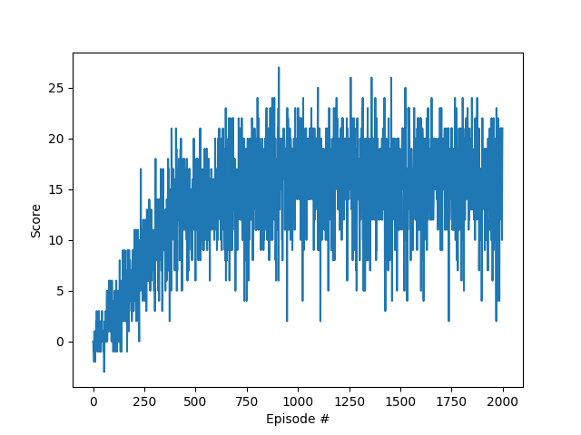

# Learning Algorithm

At each step in the episode during training, the agent obtains the action values by passing the state to the local neural network and chooses an action based on epsilon-greedy policy. Next, the agent steps through the environment by performing the selected action and receives the experience tuple, which consists of (state, action, reward, next_state, done). The agent uses the experience tuple to step through internally, which adds the expereince tuple to its replay buffer and start learning at regular intervals if the replay buffer size is big enough.

During learning, the agent will sample a batch of random experiences from its replay buffer and pass the data to its two neural networks models. Next, the gradient is calculated for the local network by calculating the mean squared error between the expected Q values and target Q values which are obtained from passing the data through the local and target network model, respectively. After the gradient is calculated, the Adam optimizer updates the weights on the local network. Finally, the target network weights are soft updated using the weights from the local network and the target network.

# Model architecture

The agent uses two neural networks which have the same architecture, both consisting of two hidden fully connected layers with dimension size of 64, each followed by a rectified linear unit for activation. The final layer is a fully connected linear layer with the output dimension matching the action size. The agent uses two models because double DQN avoids overestimation that might be present when using one model. The first or the local model is the one that the agent uses to calculate the expected Q values by forwarding the observed states and actions. The second or the target model is the one that the agent uses to compute the predicted Q values for the next states, which is used to compute the target Q values which factors in the reward, discount rate, and whether the episode is terminated.

# Hyperparameters

The epsilon for epsilon-greedy policy is initially set to 1.0 then gradually decays to 0.01 after subsequent episodes with a decay rate of 0.995. The replay buffer size is set at 100K and the batch size is 64. The agent learns every 4 steps and uses 0.99 for gamma (discount factor) and uses 0.001 tau (soft update interpolation parameter). The local network uses Adam optimizer with 0.0005 as the learning rate.

# Plot of Rewards

The agent solved the problem in 465 episodes with an average score of 13.03 and reached a max average score of 16.99 during 2000 training episodes.

# Ideas for Future Work

The agent could perform better if prioritized experience replay and dueling DQN were implemented.

Prioritized experience replay is the idea that some of the experiences might be more important than others so it makes sense to sample more important experiences more frequently during learning. We can do this by changing the sampling probability in proportion to the temporal difference error such that the experiences with higher error will get a higher probability of getting selected when sampling.

Dueling DQN is the idea of using two neural networks, one that estimates the state value function and the other which estimates the advantage value function for each action. The intuition behind dueling DQN is that the values of most states do not vary a lot across different actions, so this can be estimated by using the state value function, while the difference each action has for the state is captured by the advantange value function. The desired Q-values are then calculated by getting the sum of state value function and advantage value function.